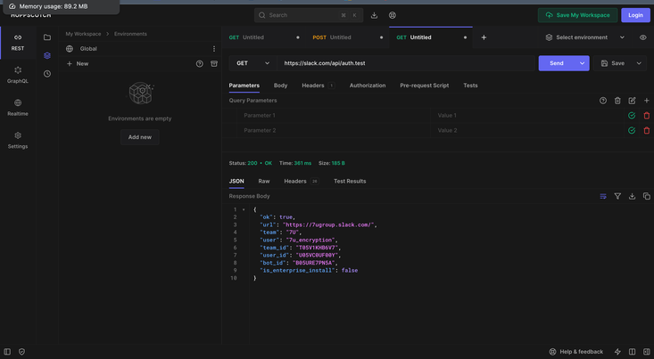

7U.
We would like to work in the field of communications security (encrypting and decrypting messages using basic cyphers like caesar's 
cypher and control access to who will see the encrypted or non encrypted information ).

link to the documentation : https://api.slack.com/docs  .

screenshot of using hoppscotch:   .

example output : 

list of technical problems : we struggled to call the API using java code and we could not figure out the exact steps to do it. 
